<p align="center">

</p>

**Agility** and **ease-of-use** batteries for the Python layer of the [FEniCS](https://fenicsproject.org/) finite element framework. The focus is on **MPI-enabled 2D** on **P1**, **P2**, **P3**, **Q1**, **Q2**, **Q3**, **DP1**, **DP2**, **DP3**, **DQ1**, **DQ2**, and **DQ3** spaces. Each routine aims to be as general as is reasonable. Some of our utilities do support 3D meshes, but this is currently not a priority. Mesh import and closely related utilities run only serially.

Usage examples can be found in the [`demo/`](demo/) subfolder.

The subpackage [`extrafeathers.pdes`](extrafeathers/pdes/) contains some modular ready-made solvers. These are mainly for use by the demos, but may be useful elsewhere. Particularly, stabilized Navier-Stokes and advection-diffusion solvers are provided.

<!-- markdown-toc start - Don't edit this section. Run M-x markdown-toc-refresh-toc -->
**Table of Contents**

- [Features](#features)
    - [Mesh-related utilities](#mesh-related-utilities)
    - [Plotting](#plotting)
    - [Mesh I/O](#mesh-io)
- [Demos (with pictures!)](#demos-with-pictures)
    - [DOF numbering related](#dof-numbering-related)
    - [Patch averaging](#patch-averaging)
    - [Poisson equation](#poisson-equation)
    - [Gmsh mesh import](#gmsh-mesh-import)
    - [Incompressible flow (Navier-Stokes)](#incompressible-flow-navier-stokes)
    - [Forced convection (one-way coupled problem)](#forced-convection-one-way-coupled-problem)
    - [Natural convection (two-way coupled problem)](#natural-convection-two-way-coupled-problem)
- [Questions & answers](#questions--answers)
    - [How to list the whole public API, and only the public API?](#how-to-list-the-whole-public-api-and-only-the-public-api)
    - [What's up with the Unicode variable names?](#whats-up-with-the-unicode-variable-names)
- [Dependencies](#dependencies)
- [Install & uninstall](#install--uninstall)
    - [From source](#from-source)
- [License](#license)
- [Thanks](#thanks)

<!-- markdown-toc end -->


## Features

*Supported mesh dimensionalities are indicated in brackets. MPI is supported, unless indicated as "serial only".*

### Mesh-related utilities

   - `cell_mf_to_expression` [**2D**, **3D**]
     - Convert a scalar `double` `MeshFunction` into a `CompiledExpression` that can be used in UFL forms.
     - For example, `h = cell_mf_to_expression(meshsize(mesh))`.
     - For full examples, see [`extrafeathers.pdes.navier_stokes`](extrafeathers/pdes/navier_stokes.py) and [`extrafeathers.pdes.advection_diffusion`](extrafeathers/pdes/advection_diffusion.py), which use this in SUPG stabilization.
   - `cellvolume` [**2D**, **3D**]
     - Compute the local cell volume for the whole mesh.
     - Convenience function; essentially just loops `dolfin.Cell.volume` over the mesh, and packs the result into a `MeshFunction`.
   - `find_subdomain_boundaries` [**2D**, **3D**] [**serial only**]
     - Automatically tag facets on internal boundaries between two subdomains. This makes it easier to respect [DRY](https://en.wikipedia.org/wiki/Don't_repeat_yourself) when setting up a small problem for testing, as the internal boundaries only need to be defined in one place (in the actual geometry).
     - Tag also facets belonging to an outer boundary of the domain, via a callback function (that you provide) that gives the tag number for a given facet. This allows easily producing one `MeshFunction` with tags for all boundaries.
     - Here *subdomain* means a `SubMesh`. These may result either from internal mesh generation via the `mshr` component of FEniCS, or from imported meshes. See the [`navier_stokes`](demo/navier_stokes.py) and [`import_gmsh`](demo/import_gmsh.py) demos for examples of both.
   - `meshsize` [**2D**, **3D**]
     - Compute the local mesh size (the `h` in finite element literature), defined as the maximum edge length of each mesh entity. The result is returned as a `MeshFunction`.
     - Can compute both cell and facet meshfunctions.
     - Useful for stabilization methods in advection-dominated problems, where `h` typically appears in the stabilization terms.
     - See the [`import_gmsh`](demo/import_gmsh.py) demo for an example.
   - `prepare_linear_export` [**2D**]
     - Exactly as it says on the tin, for P2, P3, Q2, Q3, DP2, DP3, DQ2, or DQ3 input data. Allows full nodal resolution export of degree-2 and degree-3 data into a vertex-based format (represented as refined degree-1 data).
     - That is, given a P2, P3, Q2, Q3, DP2, DP3, DQ2, or DQ3 function space, prepare a degree-1 `dolfin.Function` on an appropriately refined mesh, and a DOF mapping that can be used to interpolate DOFs from the original space onto the DOFs of the degree-1 space.
     - High-level function built on `refine_for_export` and `map_coincident`.
     - See [`demo.coupled.main01_flow`](demo/coupled/main01_flow.py) and [`demo.boussinesq.main01_solve`](demo/boussinesq/main01_solve.py) for usage examples.
   - `refine_for_export` [**2D**], `map_coincident` [**2D**, **3D**]
     - These are the low-level functions that power `prepare_linear_export`.
     - Prepare P2, P3, Q2, Q3, DP2, DP3, DQ2, or DQ3 (i.e. quadratic or cubic) data for export on a once-refined degree-1 mesh, so that it can be exported at full nodal resolution for visualization even when the file format is vertex-based.
       - Essentially, in a solver that does this, we want to `w.assign(dolfin.interpolate(u, W))`, where `W` (uppercase) is the once-refined degree-1 function space and `w` (lowercase) is a `Function` on it; this does work when running serially.
       - However, in parallel, the original and refined meshes will have different MPI partitioning (due to mesh editing to produce the refined mesh), so each process is missing access to some of the data it needs to compute its part of the interpolant. Hence we must construct a mapping between the global DOFs, allgather the whole original DOF vector, and then assign the data to the corresponding DOFs of `w`.
     - `refine_for_export` differs from `dolfin.refine` in that for triangle meshes, we guarantee an aesthetically pleasing fill, which looks best for visualizing P2/P3 data, when interpolating that data as P1 on the refined mesh. Also, `refine_for_export` always produces a global refinement; every element is refined.
       - If you don't care about the aesthetics, for quadratic data, `export_mesh = dolfin.refine(mesh)` instead of `export_mesh = extrafeathers.refine_for_export(mesh)` works just as well.
     - `map_coincident` is the low-level function that constructs a mapping between coincident DOFs on any two function spaces.
       - Supports both scalar and vector function spaces. Not tested on tensor fields yet.
       - Works with both continuous and discontinuous spaces. The practical difference is that for any scalar component of a continuous space, every DOF has a unique geometric location. In a discontinuous space, several distinct DOFs may share the same geometric location.
       - When both spaces (denoted `V` and `W` in the API) are discontinuous, the matching algorithm assumes that each cell on the mesh of `W` is contained in exactly one cell on the mesh of `V`; this allows a natural definition for "the same" DOF in the discontinuous case. The assumption is satisfied when the meshes are the same, or when `W` was produced by refining `V`. As a practically useful special case, when `V` uses quadrilateral elements, `W` may be the `quad_to_tri` of `V`.
       - The lower-level function `_map_coincident` does most of the work, and may be directly useful on special occasions. Differences to `map_coincident`:
         - Scalar function spaces only; `.sub(j)` of vector or tensor function space is accepted.
         - `_map_coincident` operates on the `extrafeathers` internal format: `cells` lists and `nodes` dictionaries, as produced by `all_cells`.
         - `_map_coincident` always returns the mappings in a multi-valued format, `Dict[int, FrozenSet[int]]`. Use `extrafeathers.common.prune` to auto-convert to single-valued `Dict[int, int]` in case all entries are actually single-valued.
         - `_map_coincident` performs no validation on its results.
     - For full usage examples, see [`demo.coupled.main01_flow`](demo/coupled/main01_flow.py) (vector), [`demo.coupled.main02_heat`](demo/coupled/main02_heat.py) (scalar), and [`demo.boussinesq.main01_solve`](demo/boussinesq/main01_solve.py) (both).
   - `quad_to_tri` [**2D**]
     - Convert a quad mesh into a triangle mesh in crossed-diagonal format, by adding a node at each cell center and then replacing each quad by four triangles (that meet at the cell center node).
     - This is used by `mpiplot` to make Matplotlib interpolate FEM functions on quadrilateral elements, by mapping the function onto an internal triangulation.
     - Operates as a filter on the `extrafeathers` internal format. See the source code of [`plotmagic`](extrafeathers/plotmagic.py) for full usage example.
   - `patch_average`, `map_dG0`
     - `map_dG0` [**2D**, **3D**]:
       - Given a function space `V` and a dG0 function space `W` on the same mesh, determine the DOFs of `W`, and mesh cells, that form the support (mathematical sense) of each DOF of `V`.
       - Return two mappings:
         - Global `V` DOF number to an `np.array` of `W` DOF numbers.
         - Global `W` DOF number to cell index.
       - This is useful as a setup step for patch averaging.
     - `patch_average` [**2D**, **3D**]:
       - Given a scalar, vector or tensor function on a P1, P2 or P3 function space, patch-average it (weighted by relative cell volumes), and return the result as a new function on the same function space as the input.
       - This is sometimes useful as a postprocess step to eliminate some checkerboard modes, such as when using LBB-incompatible element types in a Navier-Stokes solver.
       - However, instead of patch-averaging, it is in general better to interpolate (or project) to a dG0 (elementwise constant) space and then just project back to the input (continuous) space:

         ```python
         import dolfin

         W = dolfin.FunctionSpace(V.mesh(), "DG", 0)
         f_averaged = dolfin.project(dolfin.interpolate(f, W), V)
         ```

         If `V` is a P1 space, the results are identical to patch-averaging; in all other cases,
         `project(interpolate(...))` (or `project(project(...))`) does the same thing in spirit, but correctly.

         The `patch_average` function is provided just because patch-averaging is a classical
         postprocessing method.
   - `specialize` a meshfunction [**2D**, **3D**] [**serial only**]
     - Convert a `MeshFunction` on cells or facets of a full mesh into the corresponding `MeshFunction` on its `SubMesh`.
     - Cell and facet meshfunctions supported.
     - Useful e.g. when splitting a mesh with subdomains. This function allows converting the `domain_parts` and `boundary_parts` from the full mesh onto each submesh. This allows saving the submeshes, along with their subdomain and boundary tags, as individual standalone meshes in separate HDF5 mesh files. See the `import_gmsh` demo. This is useful, because (as of FEniCS 2019) `SubMesh` is not supported when running in parallel.
     - See [`demo.import_gmsh`](demo/import_gmsh.py) for an example.
   - Low-level utilities; for more information, see docstrings:
     - `all_cells`, `all_patches`, `my_cells`, `my_patches` [**2D**, **3D**]
       - As of v0.4.0, the `refine`, `vertices_only`, and `matplotlibize` options of `all_cells`/`my_cells` are only available for 2D meshes.
     - `is_anticlockwise` [**2D**]
       - Check whether a triplet of points in the plane is given in an anticlockwise order.
     - `make_mesh` [**2D**, **3D**]
       - Construct a `dolfin.Mesh` from arrays of cells and vertices, using `dolfin.MeshEditor`.
       - In MPI mode, can make a distributed mesh or an MPI-local mesh, as desired.
         - In some versions of FEniCS, some inputs may cause SCOTCH to crash when it attempts to MPI-partition the created mesh. Particularly, in FEniCS 2019, this is the case when the input data is the output of `quad_to_tri`. (That data works just fine in serial mode, and renumbering the nodes does not help.)
         - Constructing a quadrilateral mesh may fail with "cell is not orderable", even if there is just a single cell (even when extracted from a unit square quadrilateral mesh using `all_cells` and then fed back in to `make_mesh`). This is a known issue in DOLFIN [[1](https://bitbucket.org/fenics-project/dolfin/issues/997/quad-hex-meshes-need-ordering-check)] [[2](https://bitbucket.org/fenics-project/dolfin/issues/1089/quadrilateral-mesh-reordering-error)]; it should be fixed in DOLFINx, where the support for quadrilateral meshes has been improved significantly, but we do not support the next-gen FEniCS yet.
     - `renumber_nodes_by_distance` [**2D**]
       - As it says on the tin. May specify a custom origin; default is `(min(x), min(y))`.
       - Operates on the `extrafeathers` internal format.


### Plotting

   - `mpiplot` [**2D**]
     - Plot the *whole* solution in the root process while running in parallel. For quick on-the-fly visualization.
       - The full mesh and function value data is automatically pieced together from all the MPI processes.
       - Degree-2 and degree-3 data is automatically converted onto a once-refined degree-1 mesh, to display it at full nodal resolution.
     - P1, P2, P3, Q1, Q2, Q3, DP1, DP2, DP3, DQ1, DQ2 and DQ3 elements supported.
     - As of v0.4.0, scalar field only.
       - Note you can take a component of a vector or tensor field (`.sub(j)`), or interpolate an expression onto your function space, as usual. See [`demo.coupled.main01_flow`](demo/coupled/main01_flow.py) for examples.
     - Meant for debugging and visualizing simulation progress, especially for a lightweight MPI job that runs locally on a laptop (but still much faster with 4 cores rather than 1). Allows near-realtime visual feedback, and avoids the need to start [ParaView](https://www.paraview.org/) midway through the computation just to quickly check if the solver is still computing and if the results look reasonable.
     - Can optionally display the mesh and its MPI partitioning on top of the function data. See also `mpiplot_mesh` to do that separately.
   - `mpiplot_mesh` [**2D**]
     - Plot the *whole* mesh in the root process while running in parallel.
     - P1, P2, P3, Q1, Q2, Q3, DP1, DP2, DP3, DQ1, DQ2 and DQ3 elements supported.
     - Can optionally color-code the edges by MPI partitioning. Use `matplotlib.pyplot.legend` to see which is which.
     - Can optionally display the visualization edges (generated by `extrafeathers`) of a degree-2 or degree-3 `FunctionSpace`, and the edges of the internal triangulation used for function interpolation on quadrilaterals. These are shown in a fainter color, to distinguish them from element edges.
   - `plot_facet_meshfunction` [**2D**] [**serial only**]
     - Visualize whether the boundaries of a 2D mesh have been tagged as expected. Debug tool, for use when generating and importing meshes. This functionality is oddly missing from `dolfin.plot`.
     - See [`demo.import_gmsh`](demo/import_gmsh.py) for an example.
   - Low-level utilities:
     - `as_mpl_triangulation` [**2D**].
       - Represent the mesh of a scalar `dolfin.FunctionSpace` (or a component `.sub(j)` of a `VectorFunctionSpace` or `TensorFunctionSpace`) in Matplotlib format.
       - Has flags to refine degree-2 and degree-3 onto degree-1, and to represent the whole mesh or just the MPI-local part.
       - Produces both a `matplotlib.tri.Triangulation` (for function interpolation) as well as a `matplotlib.collections.PolyCollection` (element edges); and in the case of a quadrilateral mesh, some auxiliary data that can be used in mapping a function on the quads onto the triangulation (`mpiplot` uses this).
     - `pause`
       - Non-focus-stealing pause helper for prodding Matplotlib into updating the figure window, courtesy of [this StackOverflow post](https://stackoverflow.com/a/45734500).

### Mesh I/O

   - `import_gmsh` [**2D**, **3D**] [**serial only**]
     - Easily import a [Gmsh](https://gmsh.info/) mesh into FEniCS via [`meshio`](https://github.com/nschloe/meshio). Fire-and-forget convenience function for this common use case, to cover the gap created by the deprecation of the old `dolfin-convert`.
     - Simplicial meshes (triangles, tetrahedra) only.
     - Outputs a single HDF5 file with three datasets: `/mesh`, `/domain_parts` (physical cells i.e. subdomains), and `/boundary_parts` (physical facets i.e. boundaries).
   - `read_hdf5_mesh` [**2D**, **3D**]
     - Read in an imported mesh, and its physical cell and facet data.
     - When running in parallel, we let FEniCS create a fresh MPI partitioning (so that it does not matter how many processes were running when the mesh file was written).
   - `write_hdf5_mesh` [**2D**, **3D**]
     - Write a mesh, and optionally its physical cell and facet data, in the same format as the output of `import_gmsh`.


## Demos (with pictures!)

With a terminal **in the top level directory of the project**, demos are run as Python modules. This will use the version of `extrafeathers` in the source tree (instead of an installed one, if any).

Output of all demos will appear various subfolders of the `demo/output/` folder, which is automatically created if not present.

Gmsh `.msh` files and the original `.geo` files to generate them can be found in the [`demo/meshes/`](demo/meshes/) folder.

*For judging the run time of the examples that display it on the screenshot, the demos were run in MPI mode, on four cores on a laptop with an Intel i7 4710-MQ @ 2.50 GHz CPU. Newer CPUs and especially desktop PCs are probably somewhat faster.*

*Peak memory usage was under 1GB for the four MPI processes in total, due to the 2D nature of the examples, and (for any but the most trivial examples) appropriately graded meshes to focus the allocation of DOFs into those parts of the domain where the resolution is actually needed.*


### DOF numbering related

**Code**: [[global DOF numbering](demo/dofnumbering.py)] [[reference element](demo/refelement.py)]

To illustrate how FEniCS numbers the global DOFs to maximize data locality (given that each process is allocated a contiguous chunk of DOFs):

```bash
python -m demo.dofnumbering
mpirun -n 2 python -m demo.dofnumbering
mpirun python -m demo.dofnumbering
```

Can also specify the element type:

```bash
python -m demo.dofnumbering P1
python -m demo.dofnumbering P2
python -m demo.dofnumbering P3
python -m demo.dofnumbering Q1
python -m demo.dofnumbering Q2
python -m demo.dofnumbering Q3
python -m demo.dofnumbering DP1
python -m demo.dofnumbering DP2
python -m demo.dofnumbering DP3
python -m demo.dofnumbering DQ1
python -m demo.dofnumbering DQ2
python -m demo.dofnumbering DQ3
```

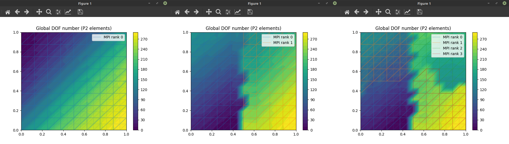

*The strong lines are element edges; the faint lines indicate the automatically generated subdivisions for visualization of the P2 function as a once-refined P1 function. Each P2 triangle is split into four P1 triangles for visualization.*

To see both the global and the reference-element DOF numbers on a 2×2 unit square mesh:

```bash
python -m demo.refelement
```

Can also specify the element type:

```bash
python -m demo.refelement P1
python -m demo.refelement P2
python -m demo.refelement P3
python -m demo.refelement Q1
python -m demo.refelement Q2
python -m demo.refelement Q3
python -m demo.refelement DP1
python -m demo.refelement DP2
python -m demo.refelement DP3
python -m demo.refelement DQ1
python -m demo.refelement DQ2
python -m demo.refelement DQ3
```

Any of these works also in MPI mode, then color-coding the MPI partitioning by edge color. MPI-local node numbers (for the global DOFs) are **not** shown.

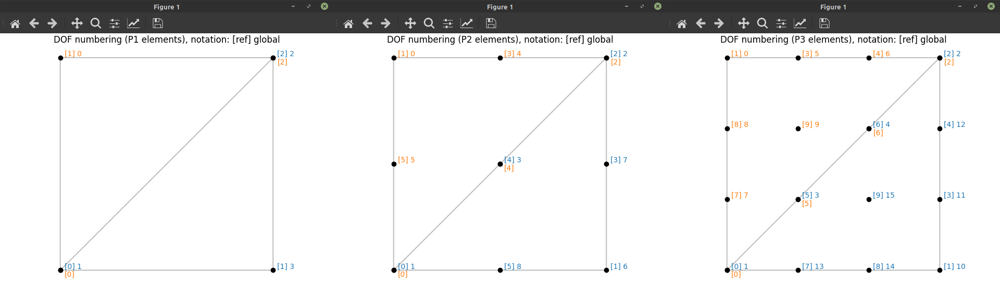

*Reference-element and global DOF numbering for P1, P2, P3, DP1, DP2, and DP3 elements.*


### Patch averaging

[[code](demo/patch_average.py)]

```bash
python -m demo.patch_average
mpirun python -m demo.patch_average
```

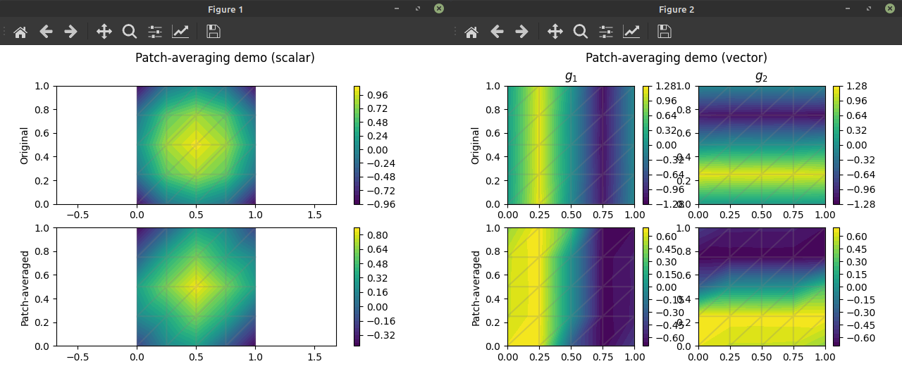


### Poisson equation

**Code**: [[classic](demo/poisson.py)] [[dG (SIPG)](demo/poisson_dg.py)]

The classic: the Poisson equation with zero Dirichlet BCs, here on an L-shaped domain. Simple example of `find_subdomain_boundaries` and `mpiplot`.

```bash
python -m demo.poisson
mpirun python -m demo.poisson
```

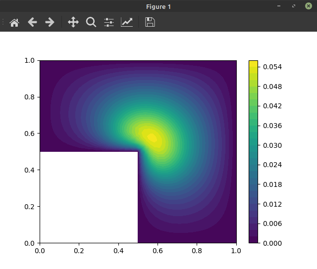

Poisson equation using symmetric interior penalty discontinuous Galerkin (SIPG) method. Example of `cell_mf_to_expression` and `meshsize`, as well as showing that `mpiplot` can plot the mesh (optionally, displaying its MPI partitioning) on top of the function data:

```bash
python -m demo.poisson_dg
mpirun python -m demo.poisson_dg
```

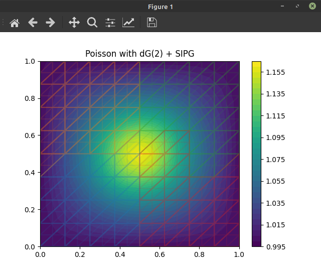

*Poisson equation with dG(2) (a.k.a. DP2) elements. Note the visualization of the elements, and MPI mesh partitioning (4 processes: blue, orange, green, red, in that order).*


### Gmsh mesh import

[[code](demo/import_gmsh.py)]

```bash
python -m demo.import_gmsh
```

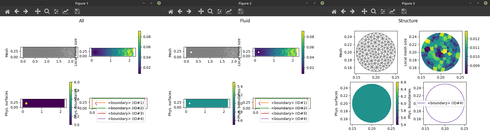

*Physical groups are extracted by the importer. Here the fluid and structure meshes are imported into separate `.h5` files.*


### Incompressible flow (Navier-Stokes)

**Code**: [[mesh import](demo/import_gmsh.py)] [[solver](demo/navier_stokes.py)]

With **uniform mesh generated via `mshr`**:

```bash
python -m demo.navier_stokes   # serial mode = generate HDF5 mesh file
mpirun python -m demo.navier_stokes   # parallel mode = solve
```

With a **graded mesh imported from Gmsh** (generated from [`demo/meshes/flow_over_cylinder.geo`](demo/meshes/flow_over_cylinder.geo)):

```bash
python -m demo.import_gmsh  # generate HDF5 mesh file, overwriting the earlier one
mpirun python -m demo.navier_stokes
```

The Gmsh mesh is recommended, to place the DOFs where they matter the most. Keep in mind [Gresho & Sani (2000)](https://www.wiley.com/en-us/Incompressible+Flow+and+the+Finite+Element+Method%2C+Volume+1%3A+Advection+Diffusion+and+Isothermal+Laminar+Flow-p-9780471492498).

This Navier-Stokes demo supports solving only in parallel.

There is a more advanced version of the Navier-Stokes solver (with better modularization and factoring of the code, as well as three kinds of numerical stabilization) in [`extrafeathers.pdes.navier_stokes`](extrafeathers/pdes/navier_stokes.py); for invoking it, see the forced convection demo below ([`demo.coupled.main01_flow`](demo/coupled/main01_flow.py)).

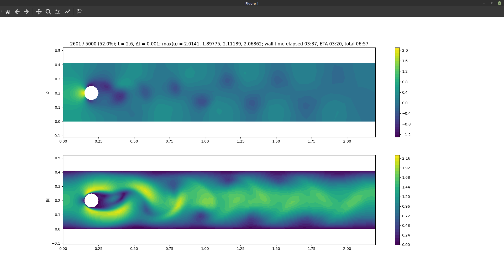

*Flow over a cylinder using P2P1 (Taylor-Hood) elements, i.e. P2 velocity and P1 pressure.*


### Forced convection (one-way coupled problem)

**Code**: [[mesh import](demo/import_gmsh.py)] [[alt. mesh import](demo/coupled/main00_alternative_mesh.py)] [[internal mesh generation](demo/coupled/main00_mesh.py)] [[configuration](demo/coupled/config.py)] [[flow solver](demo/coupled/main01_flow.py)] [[heat solver](demo/coupled/main02_heat.py)]  
**Reusable PDEs**: [[Navier-Stokes](extrafeathers/pdes/navier_stokes.py)] [[heat equation](extrafeathers/pdes/advection_diffusion.py)]

This demo uses the same HDF5 mesh file as the Navier-Stokes demo, but comes with a more advanced Navier-Stokes solver with stabilization.

Create the mesh with one of:

```bash
python -m demo.import_gmsh  # graded mesh from Gmsh
python -m demo.coupled.main00_mesh  # internal uniform mshr mesh
```

If you want flow over *two* cylinders instead of just one, we provide [another Gmsh mesh](demo/meshes/flow_over_two_cylinders.geo) for that. To import it:

```bash
python -m demo.coupled.main00_alternative_mesh
```

The actual demo is run in two stages:

```bash
mpirun python -m demo.coupled.main01_flow
mpirun python -m demo.coupled.main02_heat
```

These solvers support both serial and parallel mode; parallel mode is recommended.

Be sure to wait until the flow simulation completes before running the heat simulation; the heat solver gets its advection velocity field from the timeseries file written by the flow solver.

Some simulation parameters can be found in [`demo.coupled.config`](demo/coupled/config.py), as well as the parameters for internal `mshr` mesh generation using [`demo.coupled.main00_mesh`](demo/coupled/main00_mesh.py).

**Convergence and accuracy**:

  - With θ ≥ 1/2, the time integrator is A-stable. We use the skew-symmetric discretization for the advection term to allow this to work ([Donea & Huerta, 2003](https://www.wiley.com/en-us/Finite+Element+Methods+for+Flow+Problems-p-9780471496663), sec. 6.7.1).

  - As usual, stability does not imply accuracy; if the timestep is too large, the advection will skip over small-scale features in the flow field.

  - The solver can handle cases with pure Neumann boundary conditions on pressure (such as the standard [cavity flow example](https://www.cfd-online.com/Wiki/Lid-driven_cavity_problem)). In these cases, we define the unique pressure field as that whose mean value is zero.

  - In the flow problem, a Dirichlet boundary condition on pressure (such as at an outlet) will force the pressure to reach its prescribed boundary value *over **one** layer of elements*.
  
    Hence, it may be useful to deliberately use a low mesh resolution near the outlet, so that the discrete function space itself helps destroy any remaining nontrivial structure in the solution, before such structure gets an opportunity to hit the outflow boundary and cause a conflict with the boundary conditions (since that will often lead to a convergence failure). In an advection-dominated problem, the effects of this "smoothing by mesh geometry" on the upstream parts of the solution are negligible.

  - In the flow problem, [LBB-compatible](https://en.wikipedia.org/wiki/Ladyzhenskaya%E2%80%93Babu%C5%A1ka%E2%80%93Brezzi_condition) elements (e.g. P2P1) are recommended, but not mandatory. When P1 is used for velocity, the solver will postprocess the pressure field at the end of each timestep to eliminate checkerboard modes (which often arise as a symptom of LBB incompatibility).

    However, note that for vector P1 elements, there are no divergence-free fields except the identically zero field (as pointed out by [Brenner & Scott, 2010](https://link.springer.com/book/10.1007/978-0-387-75934-0), p. 285), so when using P1 velocity, accuracy will suffer. During software testing of multiphysics solvers, P1 velocity may still be useful, as it runs much faster. (Can use P2 just for the final simulation.)

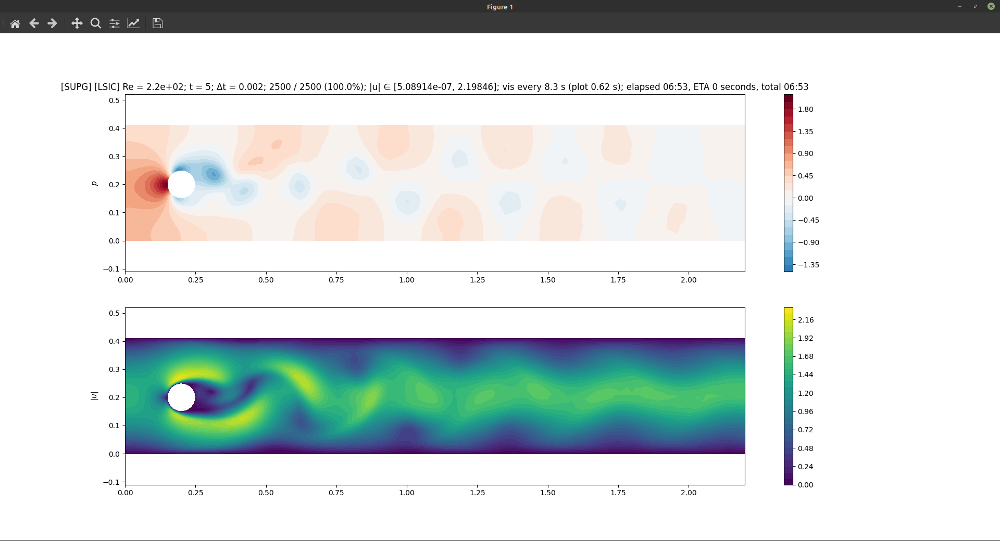

*Flow over a cylinder using the improved, stabilized solver. P2P1 (Taylor-Hood) elements. SUPG and LSIC stabilization, and skew-symmetric advection.*

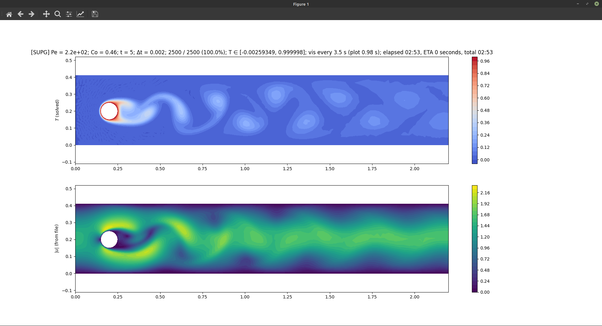

*Forced convection over a hot cylinder kept at fixed temperature. Temperature field advected by the flow. P2 elements. SUPG stabilization and skew-symmetric advection.*

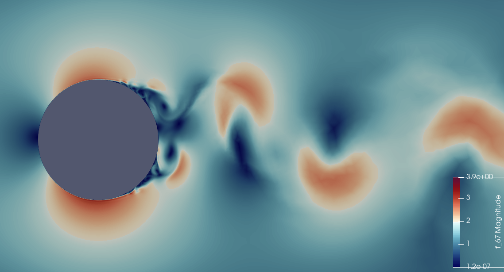

*The [advanced Navier-Stokes solver](extrafeathers/pdes/navier_stokes.py) can **survive** at Re = 1.5e5, essentially producing a [direct numerical simulation](https://en.wikipedia.org/wiki/Direct_numerical_simulation) of turbulent flow. However, for accurate results, the mesh and timestep need to be much finer than those used here. This is using the "high Re setup" in [the geometry file](demo/meshes/flow_over_cylinder.geo), and Δt = 2e-3. P2P1 elements, SUPG, LSIC, and skew-symmetric advection. Detail view of |u| near the cylinder. Visualized in ParaView.*


### Natural convection (two-way coupled problem)

**Code**: [[mesh import](demo/boussinesq/main00_mesh.py)] [[configuration](demo/coupled/config.py)] [[solver](demo/boussinesq/main01_solve.py)]  
**Reusable PDEs**: [[Navier-Stokes](extrafeathers/pdes/navier_stokes.py)] [[heat equation](extrafeathers/pdes/advection_diffusion.py)]

The model is based on the [Boussinesq approximation](https://en.wikipedia.org/wiki/Boussinesq_approximation_(buoyancy)). It uses the same Navier-Stokes solver as the forced convection demo, but now we add buoyancy via a Boussinesq source term for the velocity.

This demo has its own Gmsh mesh; see [`demo/meshes/cavity_with_obstacle.geo`](demo/meshes/cavity_with_obstacle.geo).

```bash
python -m demo.boussinesq.main00_mesh  # import Gmsh mesh
mpirun python -m demo.boussinesq.main01_solve
```

The solver supports both serial and parallel mode; parallel mode is recommended.

Some simulation parameters can be found in [`demo.boussinesq.config`](demo/boussinesq/config.py).

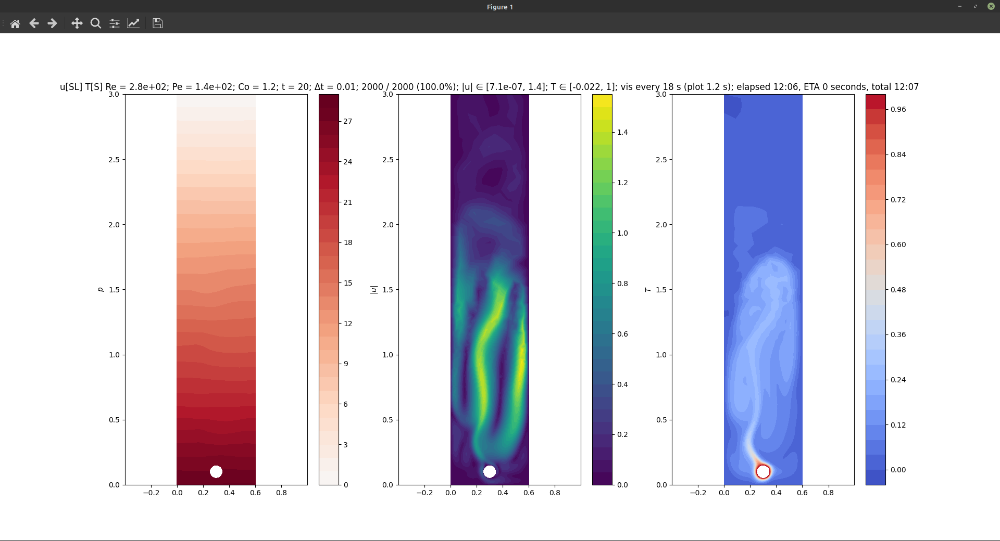

*Natural convection induced by a hot cylinder kept at fixed temperature. We use a fine mesh for y ∈ [0, 0.75], and coarsen toward y = 3.0. Note the orientation; gravity has been added to the model, pointing down in the image. The [Boussinesq approximation](https://en.wikipedia.org/wiki/Boussinesq_approximation_(buoyancy)) automatically generates the hydrostatic pressure. Flow solved using P2P1 (Taylor-Hood) elements, SUPG and LSIC stabilization, and skew-symmetric advection. Temperature solved using P2 elements, SUPG stabilization, and skew-symmetric advection.*


## Questions & answers

### How to list the whole public API, and only the public API?

In short, use Python's introspection capabilities. There are some subtleties here; below are some recipes.

To view **the public API of a given submodule**:

```python
import sys
print(sys.modules["extrafeathers.meshmagic"].__all__)  # for example
```

If the `__all__` attribute for some submodule is missing, that submodule has no public API.

To view **the whole public API**, grouped by submodule:

```python
import sys

import extrafeathers

submodules = [name for name in dir(extrafeathers)
              if f"extrafeathers.{name}" in sys.modules]

for name in submodules:
    module = sys.modules[f"extrafeathers.{name}"]
    if hasattr(module, "__all__"):  # has a public API?
        print("=" * 79)
        print(f"Public API of extrafeathers.{name}':")
        print(module.__all__)
```

**Do not** do this to retrieve the submodules:

```python
import types
submodules_wrong = [name for name in dir(extrafeathers)
                    if issubclass(type(getattr(extrafeathers, name)), types.ModuleType)] 
```

because generally speaking, it is subtly wrong. If there happens to be an object imported from a submodule that has the same name as the submodule itself, that submodule will be missing from the list, because the object overrides the submodule in the parent module's namespace. The first approach is correct and always works.


To view **the whole public API** available in the top-level namespace:

```python
import types

import extrafeathers

non_module_names = [name for name in dir(extrafeathers)
                    if not issubclass(type(getattr(extrafeathers, name)), types.ModuleType)]
print(non_module_names)
```

Now be very very careful: for the same reason as above, for the correct semantics we must use `issubclass(..., types.ModuleType)`, not `... in sys.modules`. Here we want to list each symbol in the top-level namespace of `extrafeathers` that does not point to a module; **including** any objects that override a module in the top-level namespace.


### What's up with the Unicode variable names?

Looks more like math to use `ρ` instead of `rho`. Too bad Python doesn't accept `∇` or `∂` in variable names; with those, the PDEs would look [even better](https://github.com/gridap/Gridap.jl).

To type Unicode greek symbols, use an IME such as [latex-input](https://github.com/clarkgrubb/latex-input), or Emacs's `counsel-unicode-char` (from the [`counsel`](https://melpa.org/#/counsel) package; on its features, see this [blog post](https://oremacs.com/2015/04/09/counsel-completion/)).


## Dependencies

Beside the Python-based requirements in [`requirements.txt`](requirements.txt), this depends on `libhdf5` (backend for `h5py`) and `fenics`, which are not Python packages. You'll likely also want OpenMPI to run FEniCS on multiple cores (though `fenics` likely already pulls that in).

On Ubuntu-based systems,

```bash
sudo apt install libhdf5-dev libopenmpi-dev fenics
```

should install them. `extrafeathers` was developed using `libhdf5-103`, `openmpi 4.0.3`, and `fenics 2019.2.0.5`.

If `h5py` fails to install, or crashes when trying to read/write HDF5 files, try recompiling it against the `libhdf5` headers you have; see the [build instructions](https://docs.h5py.org/en/stable/build.html#source-installation).

If you want to modify the `.geo` files and generate new meshes for some of the demos, you'll need [Gmsh](https://gmsh.info/).

Additionally, [ParaView](https://www.paraview.org/) is useful for visualizing the XDMF output files from FEniCS.


## Install & uninstall

### From source

Clone the repo from GitHub. Then, navigate to it in a terminal, and:

```bash
python -m setup install
```

possibly with `--user`, if your OS is a *nix, and you feel lucky enough to use the system Python. If not, activate your venv first; the `--user` flag is then not needed.

To uninstall:

```bash
pip uninstall extrafeathers
```

but first, make sure you're not in a folder that has an `extrafeathers` subfolder - `pip` will think it got a folder name instead of a package name, and become confused.


## License

Starting at v0.2.0, all original code in this repository is licensed under the 2-clause [BSD license](LICENSE.md).

A very large majority of the code is original. Any code fragments from forums are licensed by their respective authors under the terms the particular forum places on code contributions. In the case of StackOverflow, this means the fragments are used under the CC-BY-SA license. Attribution is given by providing the forum post URL and username in the source code comments.


## Thanks

Everyone who has posted solutions on the [old FEniCS Q&A forum](https://fenicsproject.org/qa/) (now archived) and the [discourse group](https://fenicsproject.discourse.group/); especially @Dokken. These resources were great for getting started.
