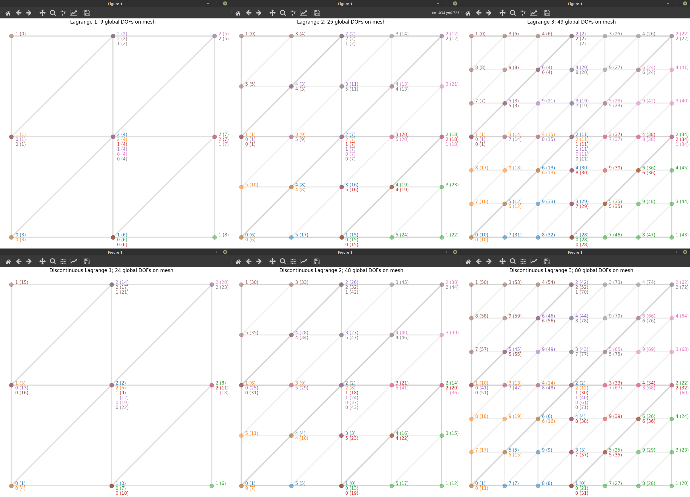

<p align="center">

</p>

**Agility** and **ease-of-use** batteries for the Python layer of the [FEniCS](https://fenicsproject.org/) finite element framework. The focus is on **MPI-enabled 2D** on **P1**, **P2** and **P3** meshes. Mesh import and closely related utilities run only serially. Most of our utilities do support 3D meshes, but this is currently not a priority.

Usage examples can be found in the [`demo/`](demo/) subfolder.

The subpackage [`extrafeathers.pdes`](extrafeathers/pdes/) contains some modular ready-made solvers. These are mainly for use by the demos, but may be useful elsewhere. Particularly, stabilized Navier-Stokes and advection-diffusion solvers are provided.

<!-- markdown-toc start - Don't edit this section. Run M-x markdown-toc-refresh-toc -->
**Table of Contents**

- [Features](#features)
    - [Mesh utilities](#mesh-utilities)
    - [Plotting](#plotting)
    - [Mesh I/O](#mesh-io)
- [Demos (with pictures!)](#demos-with-pictures)
    - [DOF numbering related](#dof-numbering-related)
    - [Patch averaging](#patch-averaging)
    - [Poisson equation](#poisson-equation)
    - [Gmsh mesh import](#gmsh-mesh-import)
    - [Navier-Stokes (incompressible flow)](#navier-stokes-incompressible-flow)
    - [Temperature field in a flow (one-way coupled problem, staged)](#temperature-field-in-a-flow-one-way-coupled-problem-staged)
    - [Boussinesq flow (natural convection, two-way coupled problem)](#boussinesq-flow-natural-convection-two-way-coupled-problem)
    - [What's up with the Unicode variable names?](#whats-up-with-the-unicode-variable-names)
- [Dependencies](#dependencies)
- [Install & uninstall](#install--uninstall)
    - [From source](#from-source)
- [License](#license)
- [Thanks](#thanks)

<!-- markdown-toc end -->


## Features

*Supported mesh dimensionalities are indicated in brackets. MPI is supported, unless indicated "serial only".*

### Mesh utilities

   - `find_subdomain_boundaries` [**2D**, **3D**] [**serial only**]
     - Automatically tag facets on internal boundaries between two subdomains. This makes it easier to respect [DRY](https://en.wikipedia.org/wiki/Don't_repeat_yourself) when setting up a small problem for testing, as the internal boundaries only need to be defined in one place (in the actual geometry).
     - Tag also facets belonging to an outer boundary of the domain, via a callback function (that you provide) that gives the tag number for a given facet. This allows easily producing one `MeshFunction` with tags for all boundaries.
     - Here *subdomain* means a `SubMesh`. These may result either from internal mesh generation via the `mshr` component of FEniCS, or from imported meshes. See the [`navier_stokes`](demo/navier_stokes.py) and [`import_gmsh`](demo/import_gmsh.py) demos for examples of both.
   - `specialize` a meshfunction [**2D**, **3D**] [**serial only**]
     - Convert a `MeshFunction` on cells or facets of a full mesh into the corresponding `MeshFunction` on its `SubMesh`.
     - Cell and facet meshfunctions supported.
     - Useful e.g. when splitting a mesh with subdomains. This function allows converting the `domain_parts` and `boundary_parts` from the full mesh onto each submesh. This allows saving the submeshes, along with their subdomain and boundary tags, as individual standalone meshes in separate HDF5 mesh files. See the `import_gmsh` demo. This is useful, because (as of FEniCS 2019) `SubMesh` is not supported when running in parallel.
     - See the [`import_gmsh`](demo/import_gmsh.py) demo for an example.
   - `meshsize` [**2D**, **3D**]
     - Compute the local mesh size (the `h` in finite element literature), defined as the maximum edge length of each mesh entity. The result is returned as a `MeshFunction`.
     - Can compute both cell and facet meshfunctions.
     - Useful for stabilization methods in advection-dominated problems, where `h` typically appears in the stabilization terms.
     - See the [`import_gmsh`](demo/import_gmsh.py) demo for an example.
   - `cell_mf_to_expression` [**2D**, **3D**]
     - Convert a scalar `double` `MeshFunction` into a `CompiledExpression` that can be used in UFL forms.
     - For example, `h = cell_mf_to_expression(meshsize(mesh))`.
     - For full examples, see [`extrafeathers.pdes.navier_stokes`](extrafeathers/pdes/navier_stokes.py) and [`extrafeathers.pdes.advection_diffusion`](extrafeathers/pdes/advection_diffusion.py), which use this in SUPG stabilization.
   - `midpoint_refine` [**2D**], `map_refined_P1` [**2D**]
     - Prepare Lagrange P2 (quadratic) or P3 (cubic) data for export on a once-refined P1 mesh, so that it can be exported at full nodal resolution for visualization.
       - Essentially, we want to `w.assign(dolfin.interpolate(u, W))`, where `W` (uppercase) is the once-refined P1 function space and `w` (lowercase) is a `Function` on it; this does work when running serially.
       - However, in parallel, the P2/P3 and P1 meshes will have different MPI partitioning, so each process is missing access to some of the data it needs to compute its part of the interpolant. Hence we must construct a mapping between the global DOFs, allgather the whole P2/P3 DOF vector, and then assign the data to the corresponding DOFs of `w`.
     - `midpoint_refine` differs from `dolfin.refine` in that we guarantee an aesthetically pleasing fill, which looks best for visualizing P2/P3 data, when interpolating that data as P1 on the refined mesh.
       - If you don't care about the aesthetics, `export_mesh = dolfin.refine(mesh)` instead of `export_mesh = extrafeathers.midpoint_refine(mesh)` works just as well.
     - `map_refined_P1` supports both scalar and vector function spaces. Not tested on tensor fields yet.
     - For full usage examples, see [`demo.coupled.main01_flow`](demo/coupled/main01_flow.py) (vector), [`demo.coupled.main02_heat`](demo/coupled/main02_heat.py) (scalar), and [`demo.boussinesq.main01_solve`](demo/boussinesq/main01_solve.py) (both).

### Plotting

   - `mpiplot` [**2D**]
     - Plot the *whole* solution in the root process while running in parallel. For quick on-the-fly visualization.
       - The full triangulation is automatically pieced together from all the MPI processes. For implementation simplicity, the visualization always uses linear triangle elements; other degrees are interpolated onto `P1`.
       - P2/P3 data is automatically converted onto once-refined P1, to display it at full nodal resolution.
     - As of v0.3.0, scalar field on a triangle mesh only.
       - Note you can take a component of a vector field, or interpolate an expression onto your function space, as usual. See [`demo.coupled.main01_flow`](demo/coupled/main01_flow.py) for examples.
     - Meant for debugging and visualizing simulation progress, especially for a lightweight MPI job that runs locally on a laptop (but still much faster with 4 cores rather than 1). Allows near-realtime visual feedback, and avoids the need to start [ParaView](https://www.paraview.org/) midway through the computation just to quickly check if the solver is still computing and if the results look reasonable.
   - `plot_facet_meshfunction` [**2D**] [**serial only**]
     - Visualize whether the boundaries of a 2D mesh have been tagged as expected. Debug tool, for use when generating and importing meshes. This functionality is oddly missing from `dolfin.plot`.
     - See the [`import_gmsh`](demo/import_gmsh.py) demo for an example.

### Mesh I/O

   - `import_gmsh` [**2D**, **3D**] [**serial only**]
     - Easily import a [Gmsh](https://gmsh.info/) mesh into FEniCS via [`meshio`](https://github.com/nschloe/meshio). Fire-and-forget convenience function for this common use case, to cover the gap created by the deprecation of the old `dolfin-convert`.
     - Simplicial meshes (triangles, tetrahedra) only.
     - Outputs a single HDF5 file with three datasets: `/mesh`, `/domain_parts` (physical cells i.e. subdomains), and `/boundary_parts` (physical facets i.e. boundaries).
   - `read_hdf5_mesh` [**2D**, **3D**]
     - Read in an imported mesh, and its physical cell and facet data.
     - When running in parallel, we let FEniCS create a fresh MPI partitioning (so that it does not matter how many processes were running when the mesh file was written).
   - `write_hdf5_mesh` [**2D**, **3D**]
     - Write a mesh, and optionally its physical cell and facet data, in the same format as the output of `import_gmsh`.


## Demos (with pictures!)

With a terminal **in the top level directory of the project**, demos are run as Python modules. This will use the version of `extrafeathers` in the source tree (instead of an installed one, if any).

Output of all demos will appear various subfolders of the `demo/output/` folder, which is automatically created if not present.

Gmsh `.msh` files and the original `.geo` files to generate them can be found in the [`demo/meshes/`](demo/meshes/) folder.

*For judging the run time of the examples that display it on the screenshot, the demos were run in MPI mode, on four cores on a laptop with an Intel i7 4710-MQ @ 2.50 GHz CPU. Newer CPUs and especially desktop PCs are probably somewhat faster.*

*Peak memory usage was under 1GB for the four MPI processes in total, due to the 2D nature of the examples, and (for any but the most trivial examples) appropriately graded meshes to focus the allocation of DOFs into those parts of the domain where the resolution is actually needed.*


### DOF numbering related

To illustrate how FEniCS numbers the global DOFs to maximize data locality:

```bash
python -m demo.dofnumbering
mpirun -n 2 python -m demo.dofnumbering
mpirun python -m demo.dofnumbering
```


*The strong lines are element edges; the faint lines indicate the automatically generated subdivisions for visualization of the P2 function as a once-refined P1 function. Each P2 triangle is split into four P1 triangles for visualization.*

To see both the global and the reference-element DOF numbers on a 2×2 unit square mesh:

```bash
python -m demo.refelement
```

Can also specify the element type:

```bash
python -m demo.refelement P1
python -m demo.refelement P2
python -m demo.refelement P3
python -m demo.refelement DP1
python -m demo.refelement DP2
python -m demo.refelement DP3
```

Any of these works also in MPI mode, showing the MPI partitioning (coded by line color).



*Local and global DOF numbering for P1, P2, P3, DP1, DP2, and DP3 elements.*


### Patch averaging

```bash
python -m demo.patch_average
mpirun python -m demo.patch_average
```


### Poisson equation

The classic: the Poisson equation with zero Dirichlet BCs, here on an L-shaped domain. Simple example of `find_subdomain_boundaries` and `mpiplot`.

```bash
python -m demo.poisson
mpirun python -m demo.poisson
```


Poisson equation using symmetric interior penalty discontinuous Galerkin (SIPG) method. Example of `cell_mf_to_expression` and `meshsize`, as well as showing that `mpiplot` can plot the mesh (optionally, displaying its MPI partitioning) on top of the function data:

```bash
python -m demo.poisson_dg
mpirun python -m demo.poisson_dg
```


*Poisson equation with dG(2) elements. Note the visualization of the elements, and MPI mesh partitioning.*


### Gmsh mesh import

```bash
python -m demo.import_gmsh
```


*Physical groups are extracted by the importer. Here the fluid and structure meshes are imported into separate `.h5` files.*


### Navier-Stokes (incompressible flow)

With **uniform mesh generated via `mshr`**:

```bash
python -m demo.navier_stokes   # serial mode = generate HDF5 mesh file
mpirun python -m demo.navier_stokes   # parallel mode = solve
```

With a **graded mesh imported from Gmsh** (generated from [`demo/meshes/flow_over_cylinder.geo`](demo/meshes/flow_over_cylinder.geo)):

```bash
python -m demo.import_gmsh  # generate HDF5 mesh file, overwriting the earlier one
mpirun python -m demo.navier_stokes
```

The Gmsh mesh is recommended, to place the DOFs where they matter the most. Keep in mind [Gresho & Sani](https://www.wiley.com/en-us/Incompressible+Flow+and+the+Finite+Element+Method%2C+Volume+1%3A+Advection+Diffusion+and+Isothermal+Laminar+Flow-p-9780471492498).

The Navier-Stokes demo supports solving only in parallel, because even a simple 2D [CFD](https://en.wikipedia.org/wiki/Computational_fluid_dynamics) problem requires so much computing power that it makes no sense to run it serially on a garden-variety multicore laptop. Also, this way we can keep the script as simple as possible, and just abuse the MPI group size to decide what to do, instead of building a proper command-line interface using [`argparse`](https://docs.python.org/3/library/argparse.html).


*Flow over a cylinder using P2P1 (Taylor-Hood) elements.*


### Temperature field in a flow (one-way coupled problem, staged)

This demo uses the same HDF5 mesh file as the *Navier-Stokes* demo. Create it with one of:

```bash
python -m demo.import_gmsh  # graded mesh from Gmsh
python -m demo.coupled.main00_mesh  # internal uniform mshr mesh
```

If you want flow over *two* cylinders instead of just one, we provide [another Gmsh mesh](demo/meshes/flow_over_two_cylinders.geo) for that. To import it:

```bash
python -m demo.coupled.main00_alternative_mesh
```

Then to run the actual demo:

```bash
mpirun python -m demo.coupled.main01_flow
mpirun python -m demo.coupled.main02_heat
```

These solvers support both serial and parallel mode; parallel mode is recommended.

Be sure to wait until the flow simulation completes before running the heat simulation; the heat solver gets its advection velocity field from the timeseries file written by the flow solver.

Some simulation parameters can be found in [`demo.coupled.config`](demo/coupled/config.py), as well as the parameters for internal `mshr` mesh generation using [`demo.coupled.main00_mesh`](demo/coupled/main00_mesh.py).


*Flow over a cylinder using the improved, stabilized solver. P2P1 (Taylor-Hood) elements. SUPG and LSIC stabilization, and skew-symmetric advection.*


*Temperature field advected by the flow. P2 elements. SUPG stabilization and skew-symmetric advection.*


### Boussinesq flow (natural convection, two-way coupled problem)

This demo has its own Gmsh mesh; see [`demo/meshes/cavity_with_obstacle.geo`](demo/meshes/cavity_with_obstacle.geo).

```bash
python -m demo.boussinesq.main00_mesh  # import Gmsh mesh
mpirun python -m demo.boussinesq.main01_solve
```

The solver supports both serial and parallel mode; parallel mode is recommended.

Some simulation parameters can be found in [`demo.boussinesq.config`](demo/boussinesq/config.py).


*Note the orientation; gravity has been added to the model, pointing down in the image. The [Boussinesq approximation](https://en.wikipedia.org/wiki/Boussinesq_approximation_(buoyancy)) automatically generates the hydrostatic pressure. Flow solved using P2P1 (Taylor-Hood) elements, SUPG and LSIC stabilization, and skew-symmetric advection. Temperature solved using P2 elements, SUPG stabilization, and skew-symmetric advection.*


### What's up with the Unicode variable names?

Looks more like math to use `ρ` instead of `rho`. Too bad Python doesn't accept `∇` or `∂` in variable names; with those, the PDEs would look [even better](https://github.com/gridap/Gridap.jl).

To type Unicode greek symbols, use an IME such as [latex-input](https://github.com/clarkgrubb/latex-input), or Emacs's `counsel-unicode-char` (from the [`counsel`](https://melpa.org/#/counsel) package; on its features, see this [blog post](https://oremacs.com/2015/04/09/counsel-completion/)).


## Dependencies

Beside the Python-based requirements in [`requirements.txt`](requirements.txt), this depends on `libhdf5` (backend for `h5py`) and `fenics`, which are not Python packages. You'll likely also want OpenMPI to run FEniCS on multiple cores (though `fenics` likely already pulls that in).

On Ubuntu-based systems,

```bash
sudo apt install libhdf5-dev libopenmpi-dev fenics
```

should install them. This was developed using `libhdf5-103`, `openmpi 4.0.3`, and `fenics 2019.2.0.5`.

If `h5py` fails to install, or crashes when trying to read/write HDF5 files, try recompiling it against the `libhdf5` headers you have; see the [build instructions](https://docs.h5py.org/en/stable/build.html#source-installation).

If you want to modify the `.geo` file and generate a new mesh for the Navier-Stokes demo, you'll need [Gmsh](https://gmsh.info/).

Additionally, [ParaView](https://www.paraview.org/) may be nice for visualizing the XDMF output files from FEniCS.


## Install & uninstall

### From source

Clone the repo from GitHub. Then, navigate to it in a terminal, and:

```bash
python -m setup install
```

possibly with `--user`, if your OS is a *nix, and you feel lucky enough to use the system Python. If not, activate your venv first; the `--user` flag is then not needed.

To uninstall:

```bash
pip uninstall extrafeathers
```

but first, make sure you're not in a folder that has an `extrafeathers` subfolder - `pip` will think it got a folder name instead of a package name, and become confused.


## License

Starting at v0.2.0, all original code in this repository is licensed under the 2-clause [BSD license](LICENSE.md).

A very large majority of the code is original. Any code fragments from forums are licensed by their respective authors under the terms the particular forum places on code contributions. In the case of StackOverflow, this means the fragments are used under the CC-BY-SA license. Attribution is given by providing the forum post URL and username in the source code comments.


## Thanks

Everyone who has posted solutions on the [old FEniCS Q&A forum](https://fenicsproject.org/qa/) (now archived) and the [discourse group](https://fenicsproject.discourse.group/); especially @Dokken.
